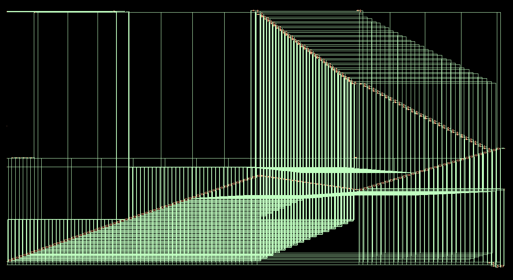
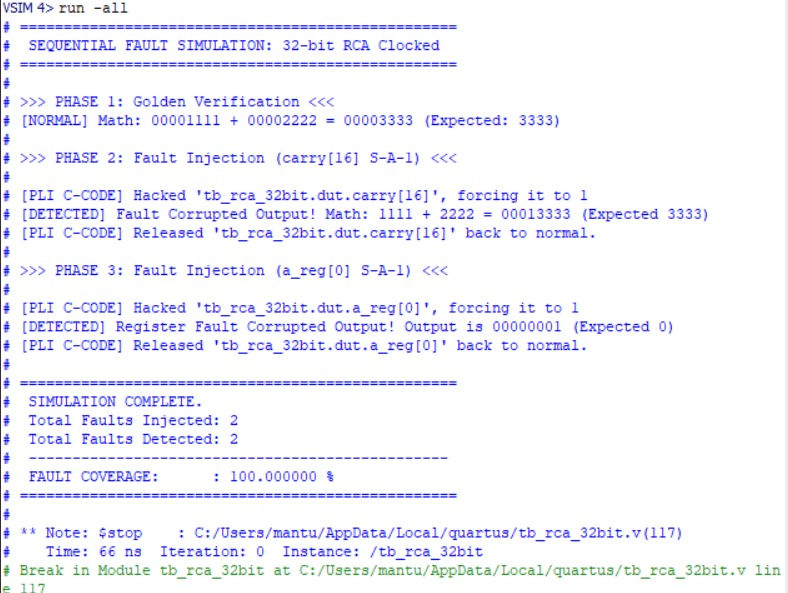

<div align="center">

# 32-bit Ripple Carry Adder: DFT Insertion & ATPG


Implementation of scan-based Design-for-Testability (DFT) architecture and ATPG workflow for a sequential 32-bit Ripple Carry Adder designed in Verilog and synthesized using Cadence EDA tools.

</div>

---


## 🎯 Overview

This project presents the implementation of **scan-based Design-for-Testability (DFT)** on a **32-bit Ripple Carry Adder (RCA)** using **Cadence Genus Synthesis Solution**, targeting a **90nm CMOS technology library**.

The objective of this work is to transform the sequential RCA design into a **testable scan-compatible architecture** by inserting scan flip-flops and establishing scan chain connectivity for enhanced controllability and observability during test mode.

The current implementation includes RTL synthesis, scan insertion, scan chain generation, and DFT verification. ATPG-based fault pattern generation using **Cadence Modus** is planned for future integration.

---

## ✨ Key Highlights

- **32-bit Sequential Ripple Carry Adder Architecture** implemented in Verilog HDL  
- **Scan-Based DFT Insertion** using Cadence Genus  
- **Single Muxed-Scan Chain Architecture** connecting all sequential elements  
- **98 Scan Flip-Flops** integrated into the final scan chain  
- **DFT Rule Verification** completed successfully  
- **Post-DFT Netlist and SCANDEF Generation** completed  
- **ATPG Integration Planned** using Cadence Modus  

---

## 🏗️ Architecture

### Design Hierarchy

```text
rca_32bit_seq (Top Module)
│
├── Input Registers (A[31:0], B[31:0])
├── Carry Input Register (Cin)
├── 32-bit Ripple Carry Adder Core
├── Output Registers (Sum[31:0])
└── Carry Output Register (Cout)
```

### Design Classification

> The Ripple Carry Adder core is combinational in nature; however, the overall design is implemented as a **sequential circuit** due to the presence of clocked registers and scan flip-flops.

---

## 🔄 DFT Flow

```text
RTL Design (rca_32bit.v)
│
├── Verilog-based sequential RCA implementation
│
▼
Synthesis (Cadence Genus)
│
├── Generic synthesis
├── Technology mapping (90nm CMOS)
│
▼
DFT Insertion
│
├── Scan flip-flop replacement
├── Scan chain connection
├── DFT rule checking
│
▼
Generated Outputs
│
├── Post-DFT Scan Netlist
├── SCANDEF File
└── Timing/Area Reports
│
▼
ATPG (Planned)
│
└── Fault Pattern Generation using Cadence Modus
```

---

## 🔗 Scan Chain Architecture

| Parameter | Value |
|----------|-------|
| Scan Style | Muxed Scan |
| Total Chains | 1 |
| Chain Length | 98 Bits |
| Shift Enable | scan_en |
| Scan Input | SI |
| Scan Output | SO |
| Clock Domain | clk |
| Scan Trigger Edge | Rising Edge |

---

## ⚙️ Synthesis Results

| Parameter | Value |
|----------|------|
| Top Module | rca_32bit_seq |
| Technology | 90nm slow.lib |
| Clock Period | 20 ns (50 MHz) |
| Critical Path | a_reg_reg[0] → sum_out_reg[31]/D |
| Data Path Delay | 6673 ps |
| Slack (WNS) | +12605 ps (MET) |
| TNS | 0 |
| Total Cells | 283 |
| Total Area | 3233.477 µm² |
| Total Power | 1.724e-04 W |

---

### Area Breakdown

| Category | Instances | Area (µm²) | Percentage |
|---------|----------|-----------|-----------|
| Sequential (SDFF) | 98 | 2448.571 | 75.7% |
| Logic (Combinational) | 112 | 605.520 | 18.7% |
| Inverters | 65 | 147.596 | 4.6% |
| Buffers | 7 | 31.790 | 1.0% |

---

### Gate Type Distribution

| Cell Type | Count | Area (µm²) |
|----------|------|-----------|
| SDFFRHQX1 (Scan FF) | 97 | 2422.837 |
| SDFFRHQX2 (Scan FF) | 1 | 25.735 |
| MXI2XL (Scan MUX) | 64 | 387.333 |
| INVX1 | 65 | 147.596 |
| AOI22XL | 16 | 96.883 |
| OAI21XL | 16 | 72.662 |
| NAND2XL | 16 | 48.442 |
| BUFX2 | 7 | 31.790 |

---

## 📊 DFT Results

| Metric | Value |
|-------|-------|
| Total Sequential Elements | 98 |
| Total Scan Cells Inserted | 98 |
| Total Scan Chains | 1 |
| Chain Length | 98 bits |
| Scan Style | Muxed Scan |
| Scan Input | scan_in |
| Scan Output | scan_out |
| Shift Enable | scan_en |
| Test Clock | clk_test |
| Registers Passing DFT Rules | 98 (100%) |
| DFT Violations | 0 |
| DFT Insertion Status | Successful |

---

## 🖼️ Post-Synthesis Schematic

The following schematic illustrates the synthesized gate-level implementation of the 32-bit Ripple Carry Adder after technology mapping and DFT insertion using Cadence Genus.

<p align="center">
  
</p>

---

### Scan Chain Connectivity

| Chain ID | Start Point | End Point | Length | Type |
|---------|------------|----------|-------|------|
| Chain 1 | scan_in | scan_out | 98 | Muxed Scan |

### Scan Register Order

| Register Group | Count |
|--------------|------|
| Input A Registers | 32 |
| Input B Registers | 32 |
| Carry Input Register | 1 |
| Sum Output Registers | 32 |
| Carry Output Register | 1 |

---

            

## 🧪 ATPG Results

| Parameter | Value |
|----------|------|
| ATPG Tool | Cadence Modus |
| Test Mode | FULLSCAN |
| Fault Model | Stuck-at Fault |
| Total Static Faults | 3762 |
| Collapsed Static Faults | 2852 |
| Total Dynamic Faults | 3818 |
| Scan Test Patterns | 1 |
| Reset/Set Test Patterns | 1 |
| Logic Test Patterns | 18 |
| Final Static Fault Coverage | 99.95% |
| Final Dynamic Fault Coverage | 42.93% |
| Untested Faults | 2 |
| Redundant Faults | 0 |
| ATPG Status | Successful |

---

### Fault Coverage Breakdown

| Fault Category | Total Faults | Tested | Untested | Coverage |
|--------------|------------|-------|---------|---------|
| Static Faults | 3762 | 3760 | 2 | 99.95% |
| Collapsed Static Faults | 2852 | 2850 | 2 | 99.93% |
| Dynamic Faults | 3818 | 1639 | 2179 | 42.93% |
| Scan Chain Faults | 2046 | 2046 | 0 | 100% |
| Reset/Set Faults | 198 | 198 | 0 | 100% |

---

### ATPG Pattern Statistics

| Test Type | Number of Patterns | Purpose |
|----------|------------------|--------|
| Scan Chain Test | 1 | Scan Shift Verification |
| Reset/Set Test | 1 | Register Reset Validation |
| Static Logic Test | 16 | Static Fault Detection |
| Final Logic Test Count | 18 | Complete ATPG Coverage |
| Total Test Sequences | 20 | Overall Generated Tests |

---

### Tool Runtime Statistics

| Operation | CPU Time | Elapsed Time |
|----------|---------|-------------|
| Build Model | 0.61 s | 1.27 s |
| Build Test Mode | 0.08 s | 1.71 s |
| Build Fault Model | 0.00 s | 0.17 s |
| Scan Test Generation | 0.05 s | 1.36 s |
| Logic Test Generation | ~1.00 s | ~1.00 s |

---

## 🧪 Fault Simulation (ModelSim)

To validate the fault detection capability of the design, manual fault injection was performed using ModelSim. Selected stuck-at faults were injected at both combinational and sequential nodes, and the resulting outputs were analyzed.

### Simulation Phases

- **Phase 1: Golden Verification**  
  The design was verified under normal conditions to establish correct reference outputs.

- **Phase 2: Fault Injection (carry[16] S-A-1)**  
  A stuck-at-1 fault was injected in the internal carry chain.

- **Phase 3: Fault Injection (a_reg[0] S-A-1)**  
  A stuck-at-1 fault was injected in the input register.

---

### Fault Simulation Results

| Fault Location | Fault Type | Expected Output | Faulty Output | Detected |
|---------------|-----------|----------------|---------------|----------|
| carry[16]     | Stuck-at-1 | 00003333       | 00013333      | Yes |
| a_reg[0]      | Stuck-at-1 | 00000000       | 00000001      | Yes |

---

### Fault Coverage Summary

| Metric | Value |
|-------|------|
| Total Faults Injected | 2 |
| Total Faults Detected | 2 |
| Fault Coverage | 100% |

---

### Simulation Output

<p align="center">
  
</p>

---

### Key Observations

- Faults in both combinational (carry chain) and sequential (register) elements were successfully detected.  
- The carry fault propagated through the ripple structure, affecting higher-order bits.  
- Register fault directly impacted the least significant bit, making it easily observable.  
- This simulation demonstrates fault detectability at the functional level prior to ATPG-based analysis.  

---

## 📝 Technical Observations

- The **32-bit Ripple Carry Adder** exhibits a relatively compact scan architecture due to its moderate sequential complexity.  
- A **single muxed-scan chain** was sufficient to accommodate all 98 sequential elements.  
- The design achieved **zero DFT rule violations**, confirming structurally valid scan insertion.  
- ATPG execution achieved **99.95% static fault coverage**, indicating highly testable architecture.  
- Only **2 faults remained untested**, with **zero redundant faults**, demonstrating efficient fault detectability.  
- The majority of synthesized area is occupied by **scan-enabled sequential elements**, contributing significantly to overall area overhead.  
- Timing analysis confirms **positive slack**, indicating that DFT insertion did not violate timing constraints.  

---


## 📂 Repository Structure

```text
.
├── rtl/
│   ├── full_adder.v
│   └── rca_32bit.v
│
├── constraints/
│   └── rca_32bit.sdc
│
├── scripts/
│   ├── run_genus_dft.tcl
│   └── run_modus_atpg.tcl
│
├── output/
│   ├── rca_32bit_post_dft.v
│   ├── rca_32bit.scandef
│   └── synthesized_netlist.v
│
├── reports/
│   ├── post_dft_area.rpt
│   ├── post_dft_power.rpt
│   ├── post_dft_timing.rpt
│   ├── scan_chain_report.rpt
│   ├── test_structures.rpt
│   ├── verify_structures.rpt
│   └── test_coverage.rpt
│
├── logs/
│   ├── genus.log
│   └── modus.log
├── images/
│   └── rca32_schematic.png
│
└── README.md
```

---

<div align="center">

### 👨‍🎓 About the Developer  

**Pranjal Upadhyay**  
Roll No.: 523EC0012  

Department of Electronics and Communication Engineering  
Integrated Bachelor and Master of Technology  

**Indian Institute of Information Technology Design and Manufacturing, Kurnool**

---

### ⭐ Star this repository if you found it helpful!

---

© 2025 Pranjal Upadhyay — All Rights Reserved

